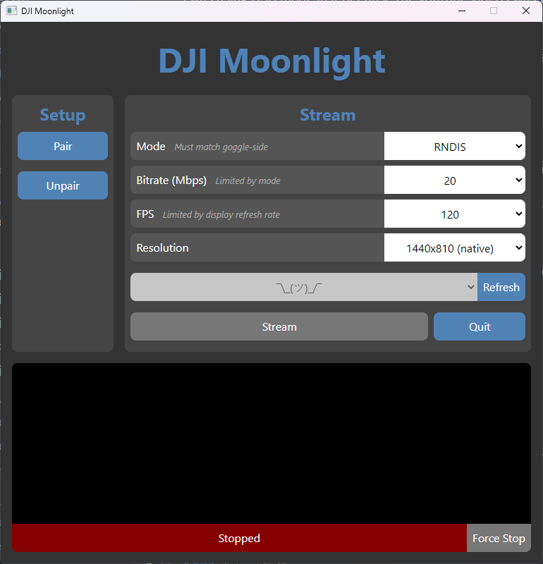

# dji-moonlight-gui

Stream games via Moonlight and [fpv.wtf](https://github.com/fpv-wtf) to your DJI
FPV Goggles!

The DJI Moonlight project is made up of three parts:

- **[dji-moonlight-shim](https://github.com/fpv-wtf/dji-moonlight-shim)**: a
  goggle-side app that displays a video stream coming in over USB.
- **[dji-moonlight-gui](https://github.com/fpv-wtf/dji-moonlight-gui)**: a
  Windows app that streams games to the shim via Moonlight and friends. _You are
  here._
- [dji-moonlight-embedded](https://github.com/fpv-wtf/dji-moonlight-embedded): a
  fork of Moonlight Embedded that can stream to the shim. The GUI app uses this
  internally.

Latency is good, in the 7-14ms range at 120Hz (w/ 5900X + 3080Ti via GeForce
Experience).

---

## Usage

### Setup

1. Install [dji-moonlight-shim](https://github.com/fpv-wtf/dji-moonlight-shim)
   on your goggles.
2. Download the [latest
   release](https://github.com/fpv-wtf/dji-moonlight-gui/releases/latest) and
   extract it.
3. Install and configure the host streaming software.

   _NVIDIA GPU?_ See [Setup: NVIDIA GPU](#setup-nvidia-gpu).

   _AMD/Intel GPU?_ See [Setup: AMD/Intel GPU](#setup-amdintel-gpu).

#### Setup: NVIDIA GPU

1. Install [GeForce
   Experience](https://www.nvidia.com/en-us/geforce/geforce-experience/). You
   almost definitely already have this installed if you've ever updated your
   drivers.
2. Open GeForce Experience and go to _Settings_ > _SHIELD_.
3. Enable _GameStream_.

   

4. GameStream will automatically detect a bunch of your games (including Steam),
   though they won't be shown in this tab. You can be more precise by adding
   games (i.e., your sim of choice) here manually.

   Want to stream everything on your desktop directly? Add
   `C:\Windows\System32\mstsc.exe` as a "game" while you're here. Selecting
   `mstsc` in the GUI will then do just that.

#### Setup: AMD/Intel GPU

See [Sunshine
documentation](https://docs.lizardbyte.dev/projects/sunshine/en/latest/) for
more guidance.

1. Download and install
   [Sunshine](https://github.com/LizardByte/Sunshine/releases/tag/latest).
2. Sunshine runs as a background service automatically and uses a locally-hosted
   web UI for settings.

   

   Go to [https://localhost:47990/](https://localhost:47990/) and set a username
   and password for future settings fanangling.

### Pairing

Before you can start streaming, you need to pair the GUI app with the host
streaming software. This only needs to be done once.

1. Run `dji-moonlight-gui.exe`.
2. Press _Pair_.
3. The PIN will be displayed in the console. This is what you'll need to enter
   in the host streaming software.

   _GeForce Experience_: A popup will appear on your PC asking you to enter the
   pin.

   _Sunshine_: Go to the [PIN tab](https://localhost:47990/pin) on the web UI
   and enter the pin.

### Streaming

1. Run `dji-moonlight-gui.exe`.
2. Configure the settings to your liking.
3. Press _Refresh_ to list your games.
4. Select a game and press _Stream_.
